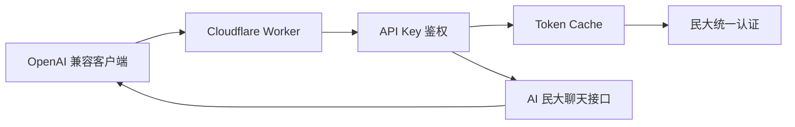

# MUChat Proxy

> 原仓库地址：https://github.com/Kenxu2022/MUChat

中央民族大学 [AI 民大](https://so.muc.edu.cn/aiqa/#/micro-app/ai-deepseek) 服务的 Cloudflare Worker 代理，提供 OpenAI 兼容聊天接口。

[](https://deploy.workers.cloudflare.com/?url=https://github.com/hungryM0/MUChat-proxy)

## 一键部署

1. 点击上面的 `Deploy to Cloudflare` 按钮
2. 按部署页面提示填写：

```text
MUC_USERNAME=学号
MUC_PASSWORD=信息门户密码
API_KEYS=鉴权令牌
```

## Serverless 架构

该仓库提供 Serverless 架构的 Cloudflare Worker 部署方式，无需自备服务器

|  | 本地部署 | Cloudflare 部署 |
| --- | --- | --- |
| 主要用途 | 开发调试 | 正式使用 |
| 运行方式 | 依赖本机环境和终端进程 | 由 Cloudflare 托管 |
| 稳定性 | 关机或断网后不可用 | 适合长期运行 |
| 配置管理 | 需要自己维护本地变量 | 在 Cloudflare 后台配置 |
| 外部调用 | 需要额外内网穿透或公网服务器 | 直接使用 Worker 地址 |



## 功能

- Bearer API Key 鉴权
- 支持模型列表 ：
  - `deepseek-v3-minda`
  - `deepseek-r1-minda`
- 支持 `stream: true` 的 OpenAI 风格 SSE 流式输出
- `deepseek-r1-minda` **不返回思考内容**，只返回最终答案


## 接口

| 方法 | 路由 | 描述 |
| --- | --- | --- |
| POST | /v1/chat/completions | 对话 |
| GET | /healthz | 健康检查 |

### 对话接口

```text
POST /v1/chat/completions
Authorization: Bearer <your-key>
Content-Type: application/json
```

`curl` 调用示例：

```bash
curl https://你的-worker-地址/v1/chat/completions \
  -H "Authorization: Bearer 你的API Key" \
  -H "Content-Type: application/json" \
  -d '{
    "model": "deepseek-v3-minda",
    "messages": [
      {
        "role": "user",
        "content": "你好"
      }
    ],
    "stream": false
  }'
```

成功时：

- `stream: false` 返回一整段 JSON
- `stream: true` 返回 OpenAI 风格的 SSE 数据流

### 健康检查

```text
GET /healthz
```

`curl` 调用示例：

```bash
curl https://你的-worker-地址/healthz
```

## 本地部署

见 [docs/local-deployment.md](./docs/local-deployment.md)

## 许可证

GPL-3.0
